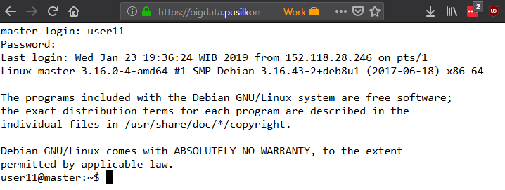

# Hands-on: Hadoop & MapReduce

> Practical exercises on Hadoop, HDFS, and MapReduce as part of Data Mining for
> Big Data short course program at Pusilkom UI.

This document describes the hands-on exercises for the participants that
Enrolled in **Data Mining for Big Data** training at
[Pusilkom UI](https://training.pusilkom.com/portal/). Each participant will
follow through the exercises to gain experience in using Hadoop and to
know MapReduce programming model.

## Table of Contents

1. [Prerequisites](#prerequisites)
2. [Getting Started](#getting-started)
3. [Managing Files in HDFS](#managing-files-in-hdfs)
4. Implementing MapReduce-based Program
5. Submitting MapReduce-based Program to Hadoop Cluster

## Prerequisites

In order to have a smooth experience in following the hands-on, please
ensure that you have installed the required software as follows:

- Modern Web browser, e.g. [Mozilla Firefox](https://www.mozilla.org/firefox/),
  [Google Chrome](https://www.google.com/chrome)
- Text editor other than Notepad, Wordpad, and Microsoft Word, e.g.
  [Visual Studio Code](https://code.visualstudio.com),
  [Notepad++](https://notepad-plus-plus.org)
- (Optional) FTP client, e.g. [FileZilla Client](https://filezilla-project.org),
  [WinSCP](https://winscp.net)
- (Optional) SSH client, e.g. [PuTTY](https://www.chiark.greenend.org.uk/~sgtatham/putty/latest.html)

Some basic proficiency with command-line interface (CLI) is required. If you
have ever used `cmd` command prompt in Windows or `bash` shell in Mac OS/
Linux-based OS, then you can follow the exercises just fine. Otherwise, you
might want to follow the mini exercises at the end of [Getting Started](#getting-started)
section.

> [Back to ToC](#table-of-contents)

## Getting Started

During this session, most of the activities will be about interacting with the
Hadoop Cluster via the master node. The master node provides tools for managing
files in HDFS and submitting MapReduce-based program that will use files in
HDFS as input.

There are two methods to access the master node:

- Use native SSH client such as PuTTY (Windows) or `ssh` (Mac OS/Linux-based
  OS) to connect to the master node available at the following host/address:
  `10.119.234.100`
- Use browser-based shell, e.g. instance of shell-in-a-box that provided when
  you access https://bigdata.pusilkom.com using Web browser

Ask the instructor(s) to obtain your credential to access the master node.
Usually the credentials are provided at the beginning of the training session.
Once you have obtained the credential, try to connect to the master node using
either approach. You should see the CLI/shell similar to the following screenshot:



Congratulations! You are now connected to the master node of a Hadoop Cluster.
If you are not familiar with CLI/shell or new to the shell in Linux-based OS, try
to follow the mini exercises below before proceeding to the next exercise.
Otherwise, feel free to skip directly to [Managing Files in HDFS](#managing-files-in-hdfs)
section.

> Note: Most commands in the shell has the following invocation pattern:
> `<COMMAND> [<OPTIONS>] <ARGS>` where:
> - `<COMMAND>` is the command, e.g. `pwd`, `ls`, `cd`
> - `[<OPTIONS>]` is optional list of options that will change how the command
>   behaves, e.g. `-l` option when calling `ls`
> - `<ARGS>` is the argument/parameter that will be read by the command to
>   perform its functionality, e.g. `mkdir foo` where `foo` is a single value
>   passed as an argument to `mkdir` command

1. `pwd`

    ```bash
    $ pwd
    ```
    > - Question #1: What does `pwd` stand for?

2. `ls`

    ```bash
    $ ls
    $ ls -a
    $ ls -a -l
    $ ls -a -l -h
    ```
    > - Question #1: What does `ls` perform?

3. `mkdir` and `rmdir`

    ```bash
    $ mkdir foo bar
    $ ls -l
    $ mkdir baz
    $ ls -l
    $ rmdir bar
    $ ls -l
    $ mkdir -p nasi/goreng/teri
    $ ls -l -R
    ```
    > - Question #1: What does `mkdir` and `rmdir` stand for?
    > - Hint: Many commands in the shell are abbreviation of name of actions that
    >   user can do when operating their computer.

4. `cd`

    ```bash
    $ pwd
    $ cd foo
    $ cd ..
    $ pwd
    $ cd nasi/goreng
    $ pwd
    $ cd ../..
    $ cd nasi/goreng
    $ pwd
    $ cd ~
    $ pwd
    ```

    > - Question #1: What does `cd` perform?
    > - Question #2: What happened when you use `~` as an argument when calling
    >  `cd`?

5. `nano`

    ```bash
    $ nano a_file.txt
    # Write some text in the CLI program
    # You can save your work by pressing CTRL-O buttons.
    # You can exit from nano by pressing CTRL-X buttons.
    ```

    > Note: `nano` is a text editor program that runs in CLI. Pretty often we
    > do not have access to graphical user interface (GUI) when operating a
    > computer/server that runs somewhere on the Internet. Therefore, it is
    > really important to get familiar with commands and CLI-based programs
    > in the shell.

6. `cat`

    ```bash
    $ cat a_file.txt
    ```

    > Question #1: What is the output of `cat` invocation above?

7. `cp`

    ```bash
    $ cp a_file.txt b_file.txt
    $ ls -l
    $ cp a_file.txt foo/a_file.txt
    $ ls -l -R
    ```

    > - Question #1: What does `cp` perform?

8. `rm`

    ```bash
    $ ls -l
    $ rm a_file.txt
    $ ls -l
    ```

    > Question #1: What happened to `a_file.txt` file?

Good job for reaching the end of the mini exercises! Now you have the basic
knowledge on using basic commands that you can call when interacting with a
Linux-based computer. In this case, the master node is actually a Linux-based
server and all exercises in the subsequent sections will require you to call
commands in the shell. You can proceed to the next section.

> [Back to ToC](#table-of-contents)

## Managing Files in HDFS

TODO

> [Back to ToC](#table-of-contents)

## Implementing MapReduce-based Program

TODO

> [Back to ToC](#table-of-contents)

## Submitting MapReduce-based Program to Hadoop Cluster

TODO

> [Back to ToC](#table-of-contents)

***

## License

This document is licensed under Creative Commons Attribution-ShareAlike 4.0
International ([CC-BY-SA 4.0](https://creativecommons.org/licenses/by-sa/4.0/)).
